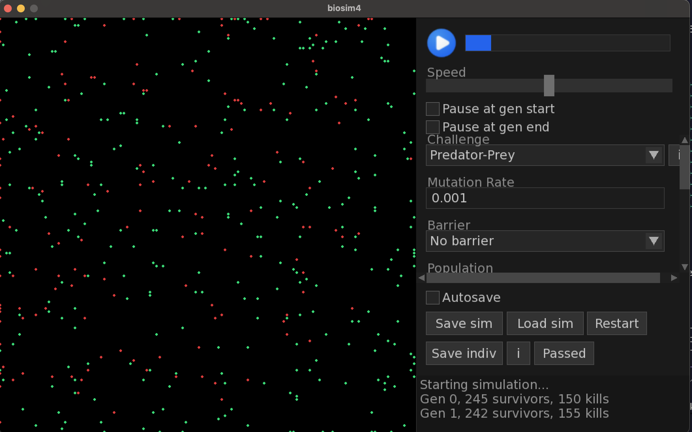

# biosim-predator-prey

A 2D grid-based neuroevolution simulator for studying predator-prey co-evolution. Predators and prey each evolve neural network-driven behaviours across generations, producing Lotka-Volterra-style population dynamics and Red Queen co-evolutionary arms races.

Built as a fork of [biosim4-sfml](https://github.com/ilyabrilev/biosim4) (which itself forks [davidrmiller/biosim4](https://github.com/davidrmiller/biosim4)), extended with a predator-prey co-evolution system, parameterised experiment sweeps, and automated statistical analysis.

**Repository:** https://github.com/clairemurphy288/biosim-predator-prey

> Full team documentation — parameter reference, statistical test descriptions, experiment matrix, and Windows setup — is in [`TEAM_DOCS.md`](TEAM_DOCS.md).

---

## System requirements

You need four things installed to build the simulator:

- **GCC 11+** (or Clang 14+) — C++20 support required
- **SFML 2.5.x** — rendering and windowed mode
- **TGUI 1.1.x** — UI widgets; must be version 1.1.x (other versions are not compatible)
- **cereal 1.3.x** — header-only C++ serialisation library (used for save/load)

Python 3.10+ is also needed for the analysis script (`tools/analyse.py`). All Python packages are installed via the virtual environment — no manual package management needed (see [Build](#build)).

---

## Installation

### macOS

```bash
brew install cmake sfml tgui cereal
```

### Ubuntu / Debian

```bash
sudo apt install build-essential cmake libsfml-dev
# TGUI 1.1.x: https://tgui.eu/tutorials/latest-stable/linux/
# cereal (header-only): https://uscilab.github.io/cereal/ — copy include/ to /usr/local/include/
```

### Windows

Use **MSYS2 + MinGW-w64** — see the [Windows Setup section in TEAM_DOCS.md](TEAM_DOCS.md#windows-setup) for step-by-step instructions.

---

## Build

```bash
make -j4
# Binary: bin/Release/biosim4
```

### Python environment

```bash
python3 -m venv .venv
source .venv/bin/activate          # macOS / Linux
# .venv\Scripts\activate           # Windows
pip install -r requirements.txt
```

---

## Quick start

### 1. Test a single headless run (~2 min)

```bash
./bin/Release/biosim4 biosim4.ini --headless
# Output → Output/Logs/epoch-log.txt
```

Expected console output:
```
Gen 1, 312 prey survived, 0 predator kills
Gen 2, 287 prey survived, 0 predator kills
...
```

Predators typically start with zero kills (they must evolve the `KILL_FORWARD` neuron first). Kill counts rise after ~20–50 generations.

### 2. Windowed mode (real-time SFML visualisation)

```bash
./bin/Release/biosim4 biosim4.ini
```

Opens an SFML window showing agents moving in the arena. Use the UI to pause/resume, zoom, and inspect individual neural networks.

### 3. Run analysis on a completed run

```bash
source .venv/bin/activate
python3 tools/analyse.py \
    --log     Output/Logs/epoch-log.txt \
    --nets    Output/Videos \
    --out     Output/analysis.png \
    --report  Output/analysis_report.md \
    --burn-in 50 \
    --split-figures
```

---

## Running the parameter sweep

The sweep script runs experiment conditions across multiple seeds and archives results to `Output/Sweep/`.

```bash
make -j4 && source .venv/bin/activate

# Preview — no files created
./tools/run_sweep.sh --dry-run

# Run specific groups
RUN_GROUPS="B1 B2 B3"  ./tools/run_sweep.sh

# Run everything (runs overnight)
./tools/run_sweep.sh
```

Edit the **EXPERIMENT MATRIX** block at the top of `tools/run_sweep.sh` to set generation count, seeds, and parameter arrays. Everything below that block is infrastructure — don't touch it.

### Sweep output layout

```
Output/Sweep/run_<timestamp>/
  <GroupDir>/
    seed_1/
      logs/epoch-log.txt        ← population dynamics
      analysis/analysis.png     ← statistical panels
      analysis/analysis_report.md
      run.ini                   ← exact parameters used
    seed_2/ ...
Output/Sweep/sweep_<timestamp>.zip  ← zipped archive for sharing
```

### Clean up between runs

```bash
./tools/clean.sh --dry-run   # preview
./tools/clean.sh             # delete all Output/ and tmp/ files
```

---

## Key configuration knobs (`biosim4.ini`)

| Parameter | What it controls | Typical values |
|-----------|-----------------|----------------|
| `challenge` | Environment type (prey survival criterion) | `20` open, `0` circle, `5` corner, `11` wall |
| `predatorFraction` | Fraction of population that are predators | `0.25`, `0.50`, `0.75` |
| `predatorActionPeriod` / `preyActionPeriod` | Speed asymmetry (lower = faster) | `1`, `2`, `3` |
| `predatorStarvationSteps` | Predator starvation deadline (`0` = off) | `0`, `60`, `120`, `220` |
| `pointMutationRate` | Per-gene mutation probability | `0.0001`, `0.001`, `0.01` |
| `RNGSeed` | Replicate seed | `1`, `2`, `3` |
| `maxGenerations` | Generations per run | `400` for sweep runs |
| `predatorPreyEnabled` | Enable two-species co-evolution | `true` / `false` |

Full variable reference: [`TEAM_DOCS.md` — Section 7](TEAM_DOCS.md#7-biosim4ini-variable-reference).

Reproducibility: set `deterministic = true`, `numThreads = 1` (do not change — multiple threads break determinism).

---

## Sample run



---

## Project structure

```
biosim4/
├── biosim4.ini              ← main config (edit experiment parameters here)
├── requirements.txt         ← Python dependencies
├── Makefile
├── src/                     ← C++ simulator source
│   ├── ai/                  ← neural network, genome, evolution
│   ├── userio/              ← SFML window and headless mode
│   ├── survivalCriteria/    ← challenge definitions
│   └── params.cpp/.h        ← all biosim4.ini parameters
├── tools/
│   ├── run_sweep.sh         ← experiment sweep runner (edit matrix here)
│   ├── analyse.py           ← generates analysis.png and analysis_report.md
│   └── clean.sh             ← wipes generated output
├── Output/                  ← all results (gitignored)
└── TEAM_DOCS.md             ← full documentation
```
